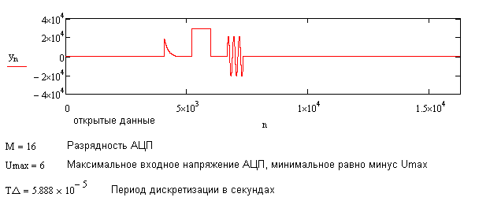

# Задание

Изучить основы цифровой обработки сигналов на примере поиска форм сигнала в записи дискретизированного сигнала, представленного в виде файла данных со следующими параметрами и содержанием:

# Результат

График сигнала полученного из [входного файла](DSP_Lab_01_File_Var_10_Att_2.dat):

Обнаруженные фигуры с указанием максимальной амплитуды (А, в вольтах), начала сигнала (τ, в секундах) и длительности сигнала (T, в секундах):

