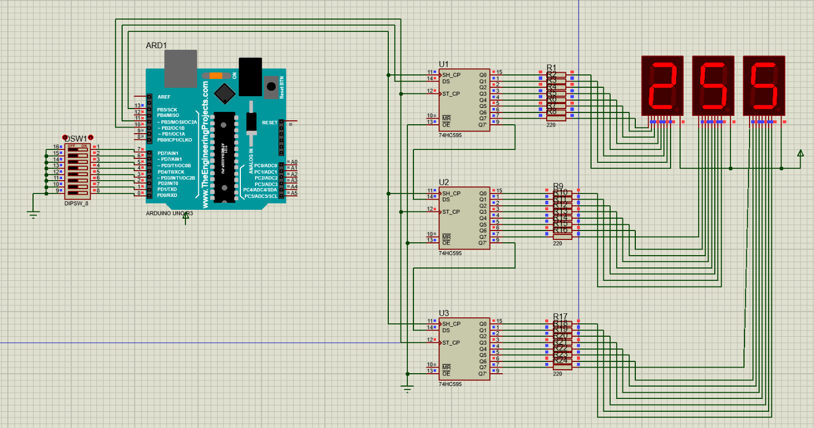

# Передача данных по I2C

Цель работы: осуществить отображение чисел от 0 до 255 в десятичной системе счисления на трех семисегментных индикаторах. Числа задаются в двоичном виде восемью переключателями, подключенными к порту ведущего микроконтроллера (master). Число преобразуется в три цифры соответствующих разрядам десятичного представления числа и передаются по интерфейсу SPI на три ведомых устройства, которые подсвечивают каждое свой разряд на подключенном к ним индикаторе.

Результат включения всех тумблеров переключателя кроме 6-ого и 4-ого:

Результат включения всех тумблеров переключателя:

