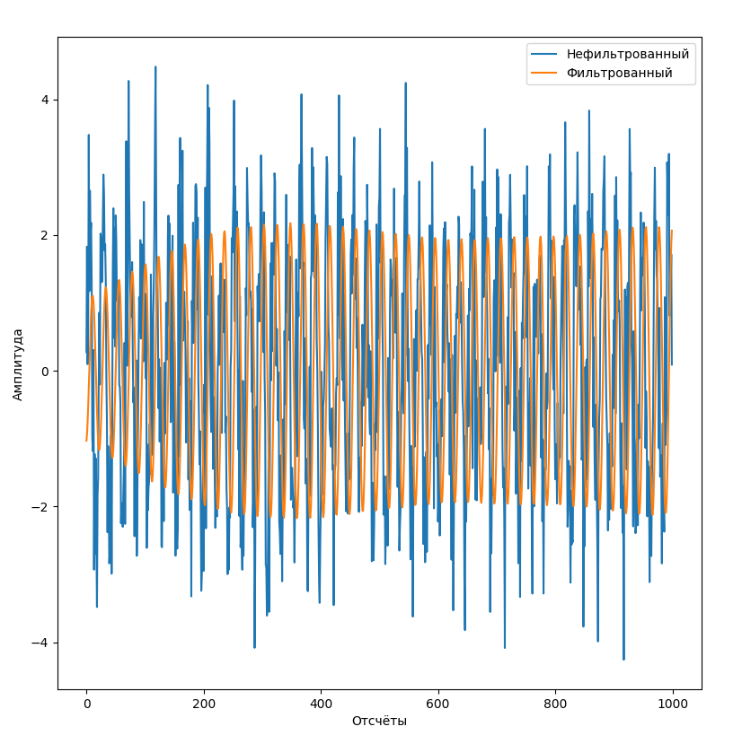
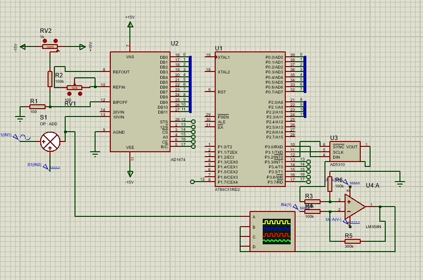

# Проектирование цифрового фильтра

В рамках курсовой работы нужно было спроектировать полосовой БИХ фильтр Баттерворта 4-ого порядка с частотами среза 390 и 410 Гц. На основе коэффициентов сгенерированных с помощью кода [этой работы](https://github.com/TestPortf/portfolio/blob/main/MetUstrCifrObr/1sem/practika/prac5) была написана [модель](10etap.py) на питоне, фильтрующая сигнал так же как это делал бы микроконтроллер. Результат фильтрации зашумлённого гаусовским шумом с мат. ожиданием 0 и дисперсией 1 сигнала с частотй 400.33 и амплитудой 2:

Далее этот алгоритм был перенесён в [код](main.c). Схема подключения АЦП и ЦАП к мк:

По заданию в качестве АЦП был использован AD1674, а в качестве ЦАП AD5310. На выходе ЦАП подкючен операционный усилитель для смещения сигнала к нулю.
